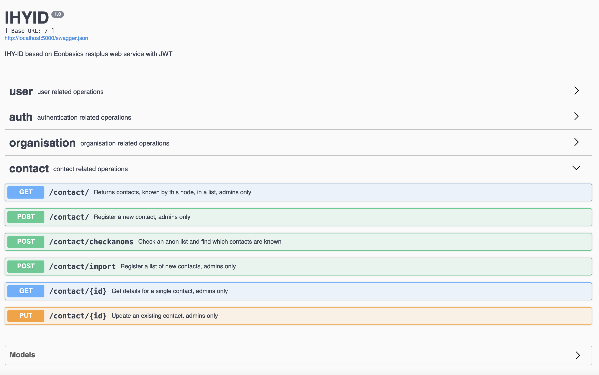

# Ihyid

## Description

This project is a prototype for a peer to peer system where organisations collect lists of contacts, deduplicate them based on phonetics and then shares anonimised version of the contacts to check which contacts organisations have in common wihtout sharing personal information.  

The project is a Flask+RestPlus API server. Most endpoints follow the REST structure, custom actions are identified by the /rpc/ token in the url. Running the server runs the swagger documentation which explains all endpoints.

## Documentation

The general idea has been outlined in "Beirut August 2020 Explosion Emergency Response, Registration Deduplication + Assistance Coordination Technical Solution"

Here is a summary of the current capabilities of Ihyid nodes:

+ save new contacts, compute their phonetic ids, create a 32 byte noise, concatenate the two and hash to create the `uscadi` id (unique, singular, common, anonymous deduplication, identifier aka `uscadi`)
+ check for duplicates based on phonetic ids
+ accept a list of uscadi and secrets (list of anonymous contacts) from another node and respond with known/unknown
+ register a new node representing another organisation collecting contacts
+ API access level is different for admin users and normal users (e.g. admin can load and see contacts, normal user can only check anon lists)

Note that `uscadi` is different node by node because the secrets are different even when the phonetic details are the same. 

### Anonymous checks

Node _A_ will create a list of its `uscadi`s and the 32 bytes noises and send the two lists to node _B_. Node _B_ will try combinations of its local phonetic ids, the received 32 bytes noises until it finds an `uscadi` matching one in the received list. Every match means that node _B_ knows the same phonetic id of node _A_ and thus knows that same contact. This is discovered without sharing contact details over the wire. The hash of the phonetic id is personal data under GDPR, so that is why phonetic ids canot be shared over the wire.

The test are the easiest way to see the logics at work: [test_contact_service.py](app/test/test_contact_service.py)

### Future Developments

+ introduce the concept of distribution list, a list of contacts which is receiving a service
+ more nodes can be invited to join a distribution list, they'll need to negotiate who is serving which contact without exchanging the contact details
+ extend the p2p workflows to create the negotiation between nodes
+ add a user interface
+ avoid non standard operations, e.g. use HMAC to generate `uscadi`, JSON canonical form to represent phonetic ids, etc..
+ introduce DIDs

The current working in progress list is in Issues.

## Installation

> All this instruction should be replicated in a container. 
> This software is written for Python 3+

To use Ihyid it is recommended to install virtualenvwrapper:

    pip3 install virtualenvwrapper

After cloning the repository:

    cd ihyid
    mkvirtualenv ihyid
    workon ihyid
    pip3 install -r requirements.txt

Before launching you need to initialize the local db with SQLAlchemy (in fact its migration folder is excluded from this repository). These functions are wrapped by `manage.py`

    python manage.py db init

> if you are developing or testing, the default suggested db is SQLlite: to allow for ALTER TABLE you need to edit the `migration/env.py` by adding `render_as_batch=True,` at around line 85, in the `context.configure` instruction

    python manage.py db migrate --message 'initial database migration'
    python manage.py db upgrade

### Configuration options

The repository comes with a template config file (`config_template.py`) that you can clone and rename in `config.py`.
The basic configuration uses SQLlite as testing db and redis as broker/backend for celery. The other options are:

+ `ADMIN_EMAIL`, `ADMIN_USERNAME`, `ADMIN_PASSWORD` the admin user details created at startup
+ `KMI_TYPE`, the type of key management infrastructure, for testing and developing there's an implementation which creates a private key file in the project folder (`DEV`), the stanard one for production is under development `PYKMIP`. When DIDs will be introduced ndoes will need to handle their own private keys and this is a basic infrastructure for that.
+ `LOCAL_FLASK_PORT`, which port will be used for Flask in localhost
+ `EONPASS_USER`, `PWD` and `URL`, will be the details to connect Ihyid to Eonpass for blockchain operations (like notarising the signatures). At the moment they are not used.
+ `key`, `SECRET_KEY`, is the one used to initialise `bcrypt` (standard for JWT tokens) and is passed via environment variable 

## Running

### Development / Test

Before running the server or the test, make sure your celery worker and broker are active:

    redis-server
    pythong manage.py celery

Running the tests:

    python manage.py test
    python manage.py singletest -n "testfilename, e.g. test_contact_service.py"    

Running a local development instance:

    python manage.py run

### Production Deployment

Ihyid must be deployed under Gunicorn and Ngnix.
w.i.p.

## Directory structure

Ihyid uses the following structure:

- `app/main` 
  - `controller`, the functions that describe the endpoints and create the swagger documentation
  - `model`, the SQLalchemy models
  - `service`, the business logics behind the endpoints described in the controllers
  - `util`, static utilities like KMI, decorators, dto, and (for now) celery tasks
- `/app/test` holds the tests
- `/migrations` the folder created by SQLalchemy on init

## Acknowledgments

This project is sponsored by [Eonpass][Eonpass] as a research activity to see how to setup a peer to peer privacy preserving network for humanitarian cash transfers. In the future we expect to extend it with well formed W3C distributed identifiers. 

The basic server architecture comes from [Eonbasics][Eonbasics], the node interface to manage a Bitcoin or Liquid node within the Eonpass protocol.

[Eonpass]: https://eonpass.com
[Eonbasics]: https://gitlab.com/Eonpass/eonbasics/
